# Visibility Graph Based Study on Stock Price Fluctuation

## Project Description

This application analyzes stock market fluctuations using visibility graphs, a method of transforming time series data into complex networks. By converting stock price movements into graph structures, the tool extracts topological features that help identify patterns and predict future price trends. The analyzer supports both a command-line Jupyter Notebook interface and an interactive Streamlit web application.

## Table of Contents

- [Installation](#installation)
- [Usage](#usage)
- [Features](#features)
- [Methodology](#methodology)
- [Examples](#examples)
- [References](#references)
- [Dependencies](#dependencies)
- [Algorithms/Mathematical Concepts Used](#algorithmsmathematical-concepts-used)
- [License](#license)
- [Acknowledgments](#acknowledgments)
- [Data Source](#data-source)
- [Note](#note)

---

## Installation

To set up the Stock Visibility Graph Analyzer, follow these steps:

1. Install the required dependencies:
   ```bash
   pip install networkx matplotlib streamlit numpy pandas seaborn pickle tqdm
   ```

2. Ensure you have the following data structure:
   - Place your stock data CSV file in the project directory
   - The CSV should include columns: 'symbol', 'f_date', 'open', 'high', 'low', 'close', 'volume'

## Usage

### Jupyter Notebook Interface

Run the Jupyter Notebook version (visibility_graph_based_study_on_stock_price_fluctuation_non_ui.ipynb) with:

```bash
jupyter notebook
```

Open the notebook and run the cell to:
1. Clean and load stock data
2. Select a stock symbol to analyze
3. Choose a window size for the moving average
4. Select which stock data field to analyze (close, open, high, avg, volume, low)
5. Generate visibility graphs
6. Extract and analyze graph features

### Streamlit Web Application

Launch the Streamlit app with:

```bash
streamlit run visibility_graph_based_study_on_stock_price_fluctuation_ui.py
```

In the web interface:
1. Upload your stock data CSV file
2. Select a stock symbol from the dropdown
3. Configure the moving average window size
4. Choose the field to analyze
5. Customize graph visualization options
6. Click "Study" to run the analysis
7. View the generated visibility graphs and feature distributions

## Features

- **Data Preprocessing**: Cleans and prepares stock market time series data
- **Sliding Window Analysis**: Creates moving averages across a user-defined window size
- **Visibility Graph Generation**: Converts time series segments into visibility graphs
- **Graph Feature Extraction**: Calculates topological metrics from visibility graphs:
  - Number of nodes and edges
  - Diameter and radius
  - Average degree and degree variance
  - Clustering coefficient
  - Eigenvector centrality
  - Edge connectivity
  - Average shortest path length
- **Trend Classification**: Labels data segments as "Increasing," "Decreasing," or "No Change"
- **Visualization**: Renders visibility graphs and feature distributions
- **Graph Customization**: Allows users to modify graph appearance (node size, colors, layout)
- **Dataset Saving**: Preserves generated graphs and feature data for future analysis

## Methodology

The analysis process follows these key steps:

1. **Data Loading and Cleaning**:
   - Import stock price data from a CSV file
   - Remove duplicates and handle missing values
   - Calculate average (avg) price from open, high, low, and close values

2. **Feature Generation**:
   - Create sliding windows of defined length from the time series
   - Extract features for each window based on the selected price metric

3. **Visibility Graph Construction**:
   - For each window, create a visibility graph where:
     - Each time point becomes a node
     - Two nodes are connected if they have "visibility" (line of sight)
     - Mathematical definition: Two points (t₁, y₁) and (t₂, y₂) are connected if any other point (t₃, y₃) between them satisfies: y₃ < y₁ + (y₂-y₁)(t₃-t₁)/(t₂-t₁)

4. **Graph Feature Extraction**:
   - Calculate topological metrics for each graph
   - These metrics capture the complexity and structure of price movements

5. **Trend Classification**:
   - Label each window as "Increasing," "Decreasing," or "No Change" based on price movement
   - Associate labels with corresponding visibility graphs

6. **Distribution Analysis**:
   - Analyze how graph features differ across trend classes
   - Visualize feature distributions to identify predictive patterns

## Examples

### Sample Visibility Graph

When analyzing stock data with a window size of 20 days, the visibility graphs typically reveal the following patterns:
- Decreasing trends often exhibit higher clustering coefficients
- Increasing trends show greater average shortest path lengths
- "No Change" periods have distinctive eigenvector centrality distributions

| *Sample image of user prompt in Jupyter Notebook version* |
|:--:| 
| 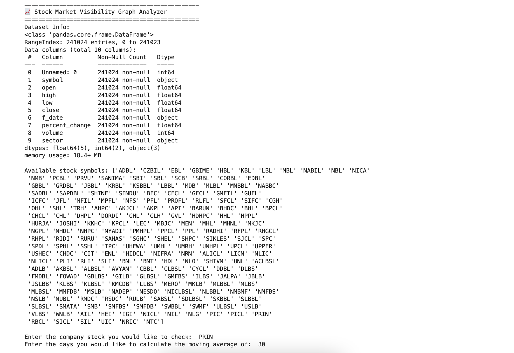 |

| *Sample image of visibility graph generation process in Jupyter Notebook version* |
|:--:| 
| 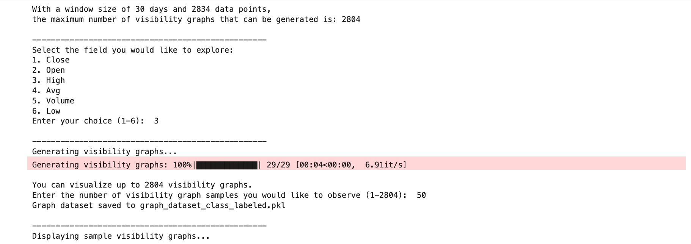 |

| *Sample image of visibility graph* |
|:--:| 
| 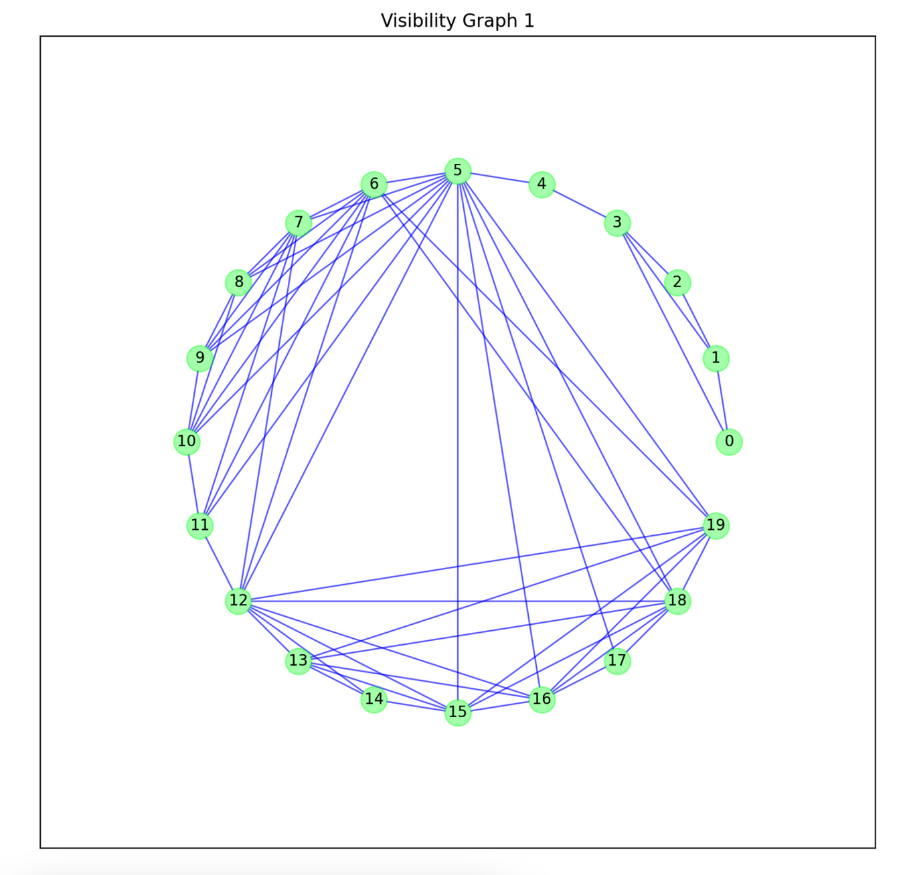 |

| *Sample image of visibility graph with user interface in Streamlit Web Application version* |
|:--:| 
| 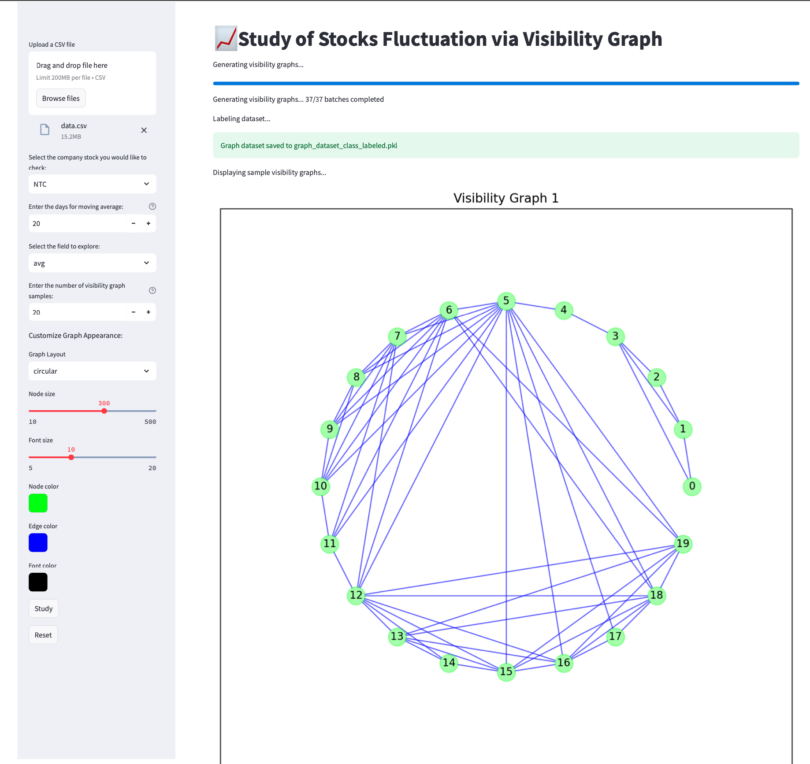 |

### Feature Distribution Example

The distribution of graph features by trend class helps identify which topological metrics are most predictive of future price movements:

| *Sample KDE plot with respect to Number of Edges* |
|:--:| 
|  |

| *Sample KDE plot with respect to Radius* |
|:--:| 
| 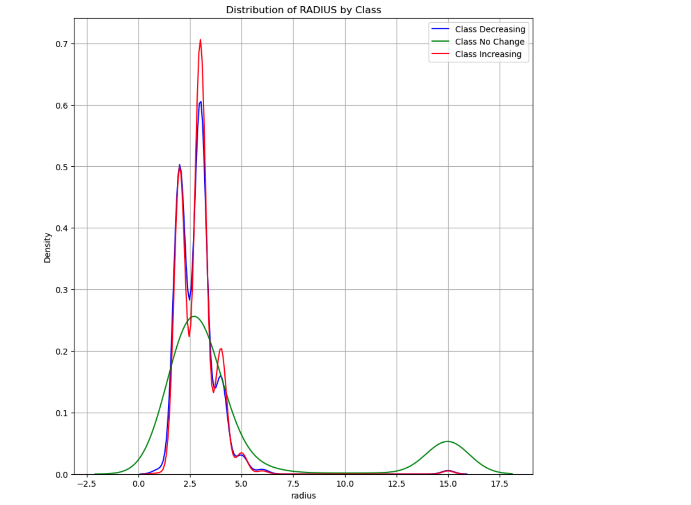 |

| *Sample KDE plot with respect to Diameter* |
|:--:| 
| 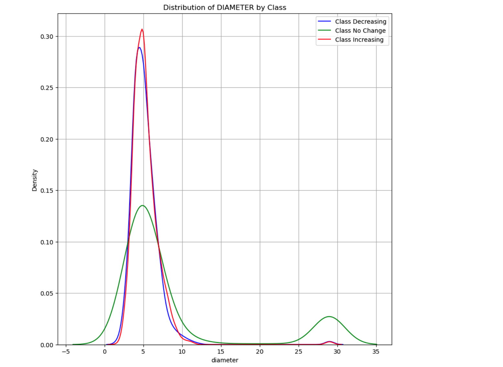 |

| *Sample KDE plot with respect to Number of Centers* |
|:--:| 
|  |

| *Sample KDE plot with respect to Average Degree* |
|:--:| 
| 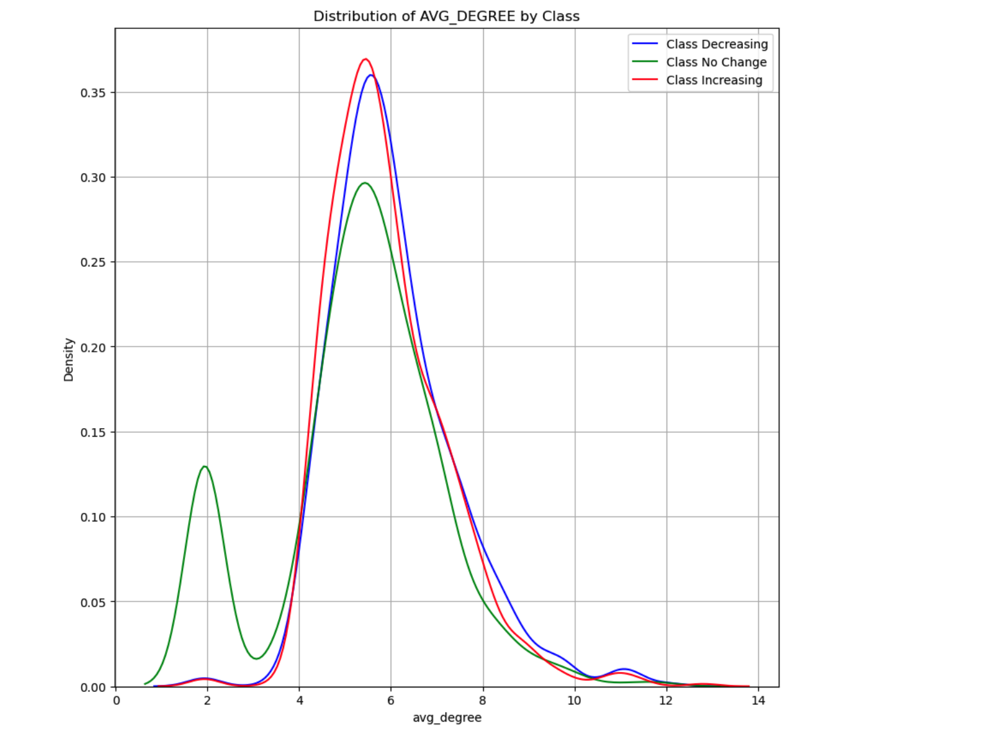 |

| *Sample KDE plot with respect to Degree Variance* |
|:--:| 
| 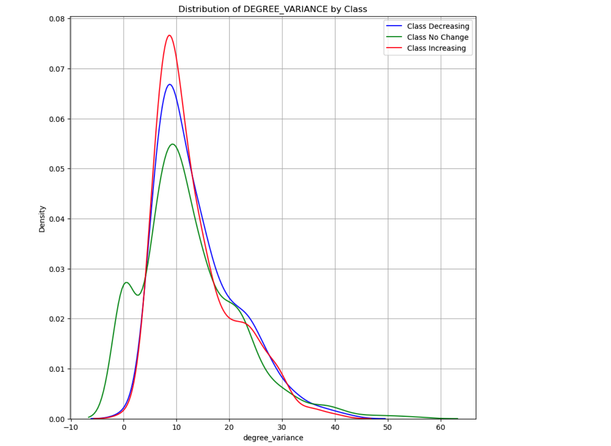 |

| *Sample KDE plot with respect to Average Shortest Path* |
|:--:| 
| 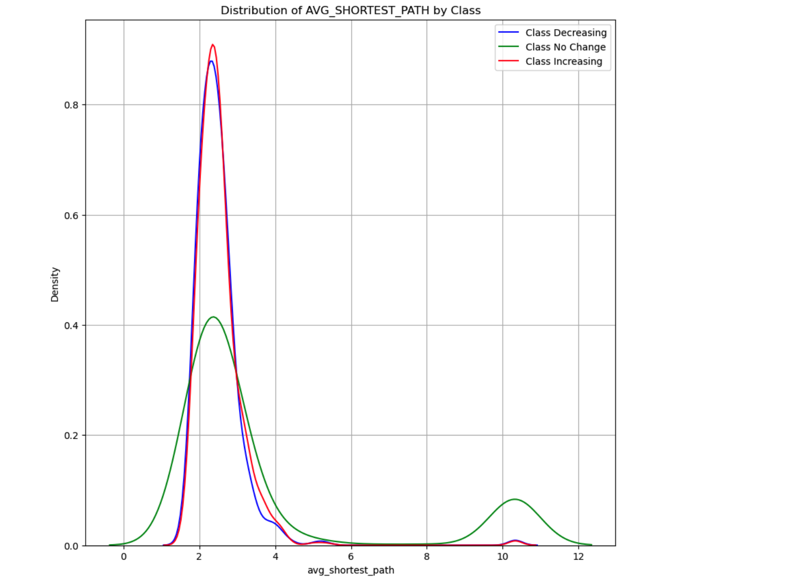 |

| *Sample KDE plot with respect to Edge Connectivity* |
|:--:| 
| 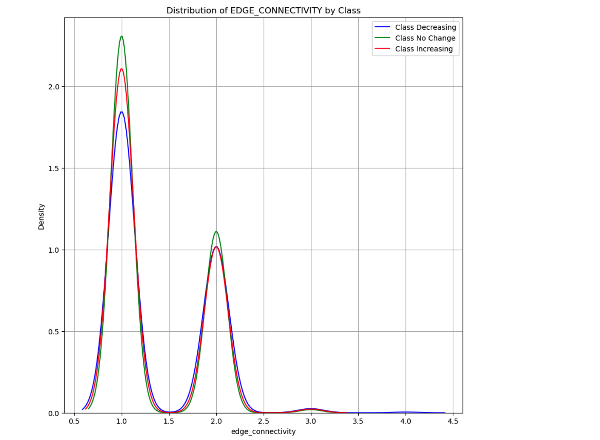 |

| *Sample KDE plot with respect to Eigenvector Centrality* |
|:--:| 
| 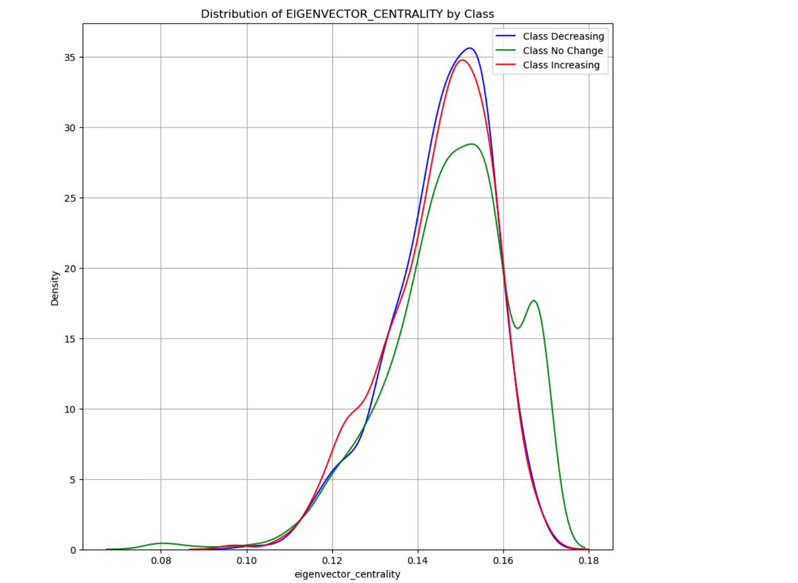 |

| *Sample KDE plot with respect to Clustering Coefficient* |
|:--:| 
| 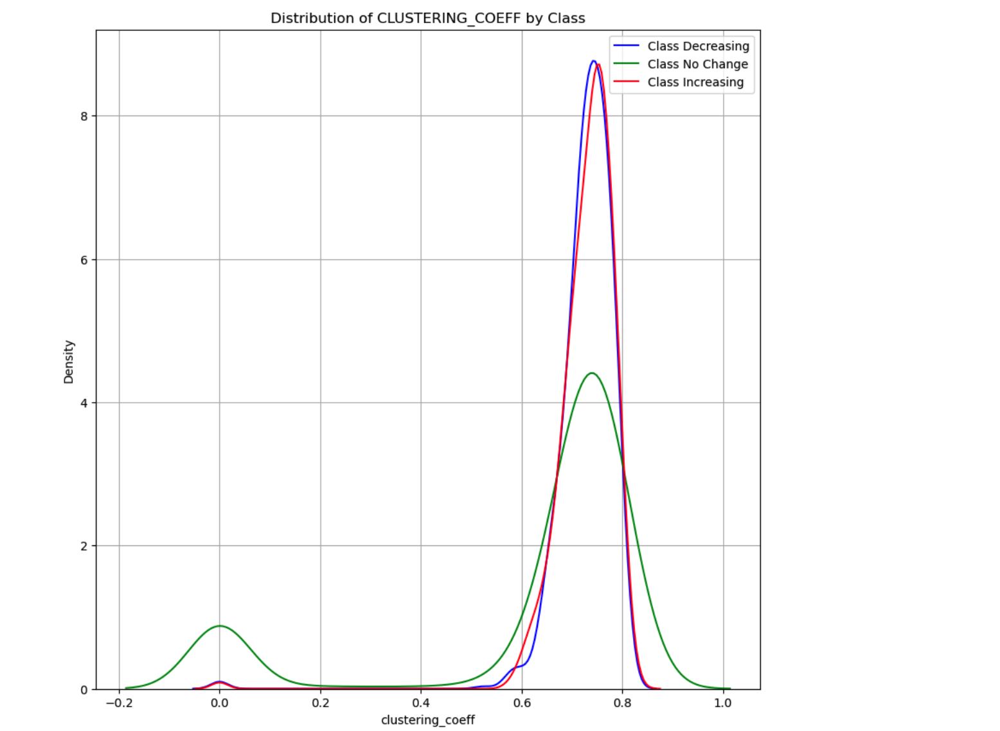 |

## References

1. Lacasa, L., Luque, B., Ballesteros, F., Luque, J., & Nuño, J. C. (2008). From time series to complex networks: The visibility graph. Proceedings of the National Academy of Sciences, 105(13), 4972-4975.
2. Yan, W., & van Serooskerken, E. (2015). Forecasting financial extremes: A network degree measure of super-exponential growth. PLOS ONE, 10(9), e0128908.
3. Xie, W. J., Zhou, W. X., & Yan, W. (2016). Detection of complex financial fluctuations using visibility graphs. Physica A: Statistical Mechanics and its Applications, 443, 235-245.

## Dependencies

- Python 3.7+
- pandas
- numpy
- matplotlib
- networkx
- seaborn
- streamlit
- pickle
- tqdm (for Jupyter Notebook version)

## Algorithms/Mathematical Concepts Used

### Visibility Graph Algorithm

The core mathematical concept is the visibility graph transformation, which maps a time series to a complex network. The algorithm creates edges between data points that satisfy the visibility condition:

For any three points (t_a, y_a), (t_b, y_b), and (t_c, y_c) where t_a < t_c < t_b:
- A direct edge exists between points a and b if:
  y_c < y_a + (y_b - y_a)(t_c - t_a)/(t_b - t_a)

### Graph Theoretic Metrics

The analysis leverages several graph theory concepts:
- **Degree Distribution**: Probability distribution of node connections
- **Clustering Coefficient**: Measure of node grouping tendencies
- **Shortest Path Length**: Minimum distance between nodes
- **Eigenvector Centrality**: Measure of node influence
- **Edge Connectivity**: Minimum number of edges to disconnect the graph

### Statistical Analysis

- Kernel Density Estimation (KDE) for feature distribution visualization
- Time series segmentation via sliding windows
- Trend classification based on comparative time point analysis

## License

This project is licensed under the MIT License - see the [LICENSE](LICENSE) file for details.

## Acknowledgments

- [NetworkX](https://networkx.org/) team for their comprehensive graph theory implementation
- [Streamlit](https://streamlit.io/) for enabling rapid development of interactive data applications
- The complex networks research community for developing visibility graph methodology

## Data Source

The stock market data used in this project can be obtained from:
- [Nepse Alpha](https://nepsealpha.com/nepse-data)

Please ensure your data CSV includes the following columns:
- 'symbol': Stock ticker symbol
- 'f_date': Date in format YYYY-MM-DD
- 'open', 'high', 'low', 'close': Daily price data
- 'volume': Trading volume
- Optional: 'sector', 'percent_change'

## Note

| AI was used to generate most of the docstrings and inline comments in the code. |
|:--:|
